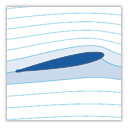

<!--
*** Thanks for checking out the Best-README-Template. If you have a suggestion
*** that would make this better, please fork the repo and create a pull request
*** or simply open an issue with the tag "enhancement".
*** Thanks again! Now go create something AMAZING! :D
***
***
***
*** To avoid retyping too much info. Do a search and replace for the following:
*** github_username, repo_name, twitter_handle, email, project_title, project_description.
-->


<!-- PROJECT SHIELDS -->
<!--
*** I'm using markdown "reference style" links for readability.
*** Reference links are enclosed in brackets [ ] instead of parentheses ( ).
*** See the bottom of this document for the declaration of the reference variables
*** for contributors-url, forks-url, etc. This is an optional, concise syntax you may use.
*** https://www.markdownguide.org/basic-syntax/#reference-style-links
-->
[![Contributors][contributors-shield]][contributors-url]
[![Forks][forks-shield]][forks-url]
[![Stargazers][stars-shield]][stars-url]
[![Issues][issues-shield]][issues-url]
[![MIT License][license-shield]][license-url]
[![LinkedIn][linkedin-shield]][linkedin-url]


<!-- PROJECT LOGO -->
<br />
<p align="center">
  <a href="https://github.com/github_username/repo_name">
    
  </a>

  <h3 align="center">Airfoils</h3>

  <p align="center">
    The goal of this projet is to build a model for prediction of aerodynamic characteristics of an airfoil based on its geometry.
    <br />
    <a href="https://github.com/inotin/airfoils"><strong>Explore the docs »</strong></a>
    <br />
    <br />
    <a href="https://github.com/inotin/airfoils">View Demo</a>
    ·
    <a href="https://github.com/inotin/airfoils/issues">Report Bug</a>
    ·
    <a href="https://github.com/inotin/airfoils/issues">Request Feature</a>
  </p>
</p>


<!-- TABLE OF CONTENTS -->
<details open="open">
  <summary><h2 style="display: inline-block">Table of Contents</h2></summary>
  <ol>
    <li>
      <a href="#about-the-project">About The Project</a>
      <ul>
        <li><a href="#built-with">Built With</a></li>
      </ul>
    </li>
    <li>
      <a href="#getting-started">Getting Started</a>
      <ul>
        <li><a href="#prerequisites">Prerequisites</a></li>
        <li><a href="#installation">Installation</a></li>
      </ul>
    </li>
    <li><a href="#usage">Usage</a></li>
    <li><a href="#roadmap">Roadmap</a></li>
    <li><a href="#contributing">Contributing</a></li>
    <li><a href="#license">License</a></li>
    <li><a href="#contact">Contact</a></li>
    <li><a href="#acknowledgements">Acknowledgements</a></li>
  </ol>
</details>


<!-- ABOUT THE PROJECT -->
## About The Project

I really love planes and aviation in general. Even though I understand underlying principles and physics of an aircraft, it is always fascinating to see these beatiful machines flying. It's like magic. The main reason why they fly is the lift force generated by the wing. The lift force appears due to special geometry of an airfoil (cross section of the wing) which creates a zone of lower pressure above the wing and higher pressure under the wing. This pressure difference basically lifts the aircraft in the air (apart of magic, joking).
There are so many types of airfoils for different types of aircraft, different airspeeds and etc. Each of them has its individual set of aerodynamic properties, of which two major ones are:

* coefficient of lift (Cl), which describes how much lift wing with such shape generates
* coefficient of drag (Cd), which describes how much drag wing with such shape generates

One of the interesting tasks which aerospace engineers face is developing optimal airfoil with a certain lift to drag ratio. The traditional approaches is to conduct simulation (CFD analysis) using specialized software and then perform real experiments using wind tunnels. The results of such experiments are put into airfoil databases for further use. What I decided to do is to solve a reverse task, i.e. having a bunch of experimental results for certain geometries, predict aerodynamic properties for a previously unseen airfoil.

#### Dataset info

The dataset is really small by now and consists of 118 records of airfoils with corresponding aerodynamic properties.
The problem is that there are not many available sources, usually the this type of information is provided in the form of experimental report scans. Only few of them are digitized by enthusiasts, one of such files can be found here: Source
To solve this problem in the future it is possible to use CFD simulations for gaining new data or form a team which would digitize experimental reports

##### Features:

Coordinates of points froming an airfoil
Angle of attack - angle between airflow and airfoil which affects aerodynamic properties

##### Target variable:
Cl - coefficient of lift

### To-do
- [x] Data preprocessing
- [x] Visuals
- [x] Implement a Random Forest Model
- [ ] Build a NN model
- [ ] Obtain more data
- [ ] Create a script adapted for general usage


<!-- GETTING STARTED -->
## Getting Started

To get a local copy up and running follow these simple steps.

### Installation

1. Clone the repo
   ```sh
   git clone https://github.com/inotin/airfoils.git
   ```
2. Install necessary packages
   ```sh
   pip install -r requirements.txt
   ```


<!-- USAGE EXAMPLES -->
## Usage
By now you can use notebook. The sript for processing generic airfoils will be added later.


<!-- ROADMAP -->
## Roadmap

See the [open issues](https://github.com/github_username/repo_name/issues) for a list of proposed features (and known issues).


<!-- CONTRIBUTING -->
## Contributing

Contributions are what make the open source community such an amazing place to be learn, inspire, and create. Any contributions you make are **greatly appreciated**.

1. Fork the Project
2. Create your Feature Branch (`git checkout -b feature/AmazingFeature`)
3. Commit your Changes (`git commit -m 'Add some AmazingFeature'`)
4. Push to the Branch (`git push origin feature/AmazingFeature`)
5. Open a Pull Request


<!-- LICENSE -->
## License

Distributed under the MIT License. See `LICENSE` for more information.


<!-- CONTACT -->
## Contact

Ilia Notin - ilia@notin.it

Project Link: [https://github.com/inotin/airfoils](https://github.com/inotin/airfoils)


<!-- ACKNOWLEDGEMENTS -->
## Acknowledgements
* [Template for README.md](https://github.com/othneildrew/Best-README-Template/graphs/contributors)


<!-- MARKDOWN LINKS & IMAGES -->
<!-- https://www.markdownguide.org/basic-syntax/#reference-style-links -->
[contributors-shield]: https://img.shields.io/github/contributors/inotin/airfoils.svg?style=flat-square
[contributors-url]: https://github.com/inotin/airfoils/graphs/contributors
[forks-shield]: https://img.shields.io/github/forks/inotin/airfoils.svg?style=flat-square
[forks-url]: https://github.com/inotin/airfoils/network/members
[stars-shield]: https://img.shields.io/github/stars/inotin/airfoils.svg?style=flat-square
[stars-url]: https://github.com/inotin/airfoils/stargazers
[issues-shield]: https://img.shields.io/github/issues/inotin/airfoils.svg?style=flat-square
[issues-url]: https://github.com/inotin/airfoils/issues
[license-shield]: https://img.shields.io/github/license/inotin/airfoils.svg?style=flat-square
[license-url]: https://github.com/inotin/airfoils/blob/master/LICENSE.txt
[linkedin-shield]: https://img.shields.io/badge/-LinkedIn-black.svg?style=flat-square&logo=linkedin&colorB=555
[linkedin-url]: https://www.linkedin.com/in/inotin/
[product-screenshot]: images/screenshot.png
